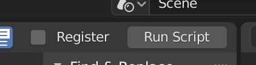
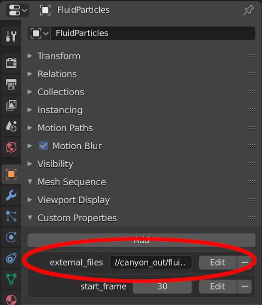

# /scenes
This directory contains scenes on which you can run the fluid simulation and ```.blend``` files for visualizing the scenes.

The following instructions show how to create the canyon scene.

## 1. Run the simulation for the canyon scene
```bash
# Start in the project root
cd scenes

# Run the simulation with the pretrained network
# with TensorFlow
../scripts/run_network.py --weights ../scripts/pretrained_model_weights.h5 \
                          --scene canyon_scene.json \
                          --output canyon_out \
                          --num_steps 1500 \
                          ../scripts/train_network_tf.py
# or with PyTorch
../scripts/run_network.py --weights ../scripts/pretrained_model_weights.pt \
                          --scene canyon_scene.json \
                          --output canyon_out \
                          --num_steps 1500 \
                          ../scripts/train_network_torch.py
```

## 2. Create a surface mesh
This step is optional and can be skipped if you want to visualize only the particles.
The following will create a ```.ply``` file for each input file. 
```bash
./scripts/create_surface_meshes.py --input_glob "canyon_out/fluid*.npz" \
                                   --outdir canyon_out
```
The script requires OpenVDB with python bindings.

## 3. Render with blender
Open ```canyon_render.blend``` with blender (we used 2.82a).
After loading the scripting workspace will be active and you should see the file ```utils/blender_external_mesh.py```.
This script will load the particle data into the *FluidParticles* every time the current frame changes.

Run the script by pressing the *Run Script* button in the top right corner of the text editor.



To run the script every time you load the file check the *Register* option next to it.
This is useful if you want to render using blender's command line interface.

After running the script you can go to the *Layout* workspace to inspect the scene.
If you change the current frame the particles of the *FluidParticles* object should change.

> Note that the blend file was not intended for interactive visualization. Changing the current frame can take some time depending on the number of particles and your system. It is therefore best to directly enter the new frame number instead of moving the current frame marker with the mouse.

The location of the external data is defined in the custom object properties.
The property *external_files* defines a glob pattern that selects the particle data that will be loaded on frame changes.
Check the glob pattern if the particles do not change with each frame change or if you want to select other data to visualize.



After checking that the loading of the particle data works you can render the animation.

## 3a. Rendering the fluid surface
### Installing plyfile in blender
Loading the surface meshes requires to install the python package *plyfile* in blender's python environment.
To get the location of blender's python binary you can use the following in blender's console window.
```python
# inside blenders python console window
print(bpy.app.binary_path_python) # this will print the path to the python binary.
```

Once you have located the python binary you can install the *plyfile* package with
```bash
# inside a shell with 'blenders_python_bin' as the path to blender's python binary
blenders_python_bin -m ensurepip
blenders_python_bin -m pip install plyfile
```

### Selecting the object for rendering the surface
To visualize the surface created in step 2, hide the *FluidParticles* object and make the object *FluidSurface* visible.
Make sure that the visibility is right for the viewport as well as the renders.

After checking that the loading of the mesh data works you can render the animation.

